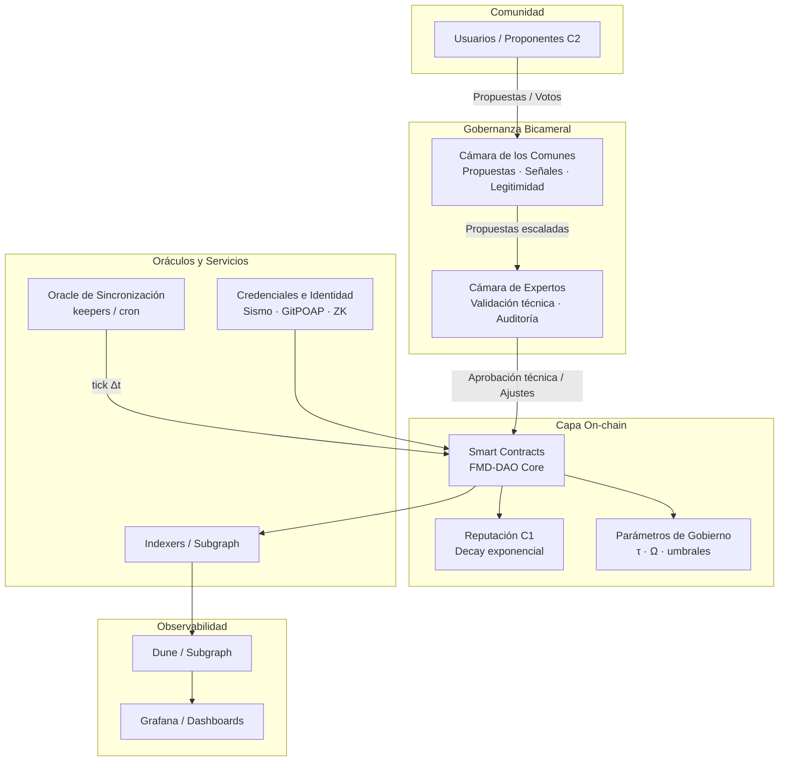
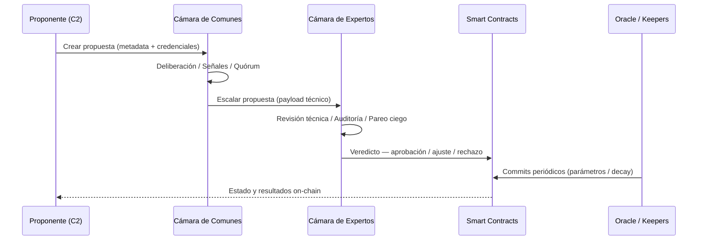
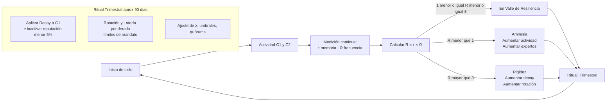
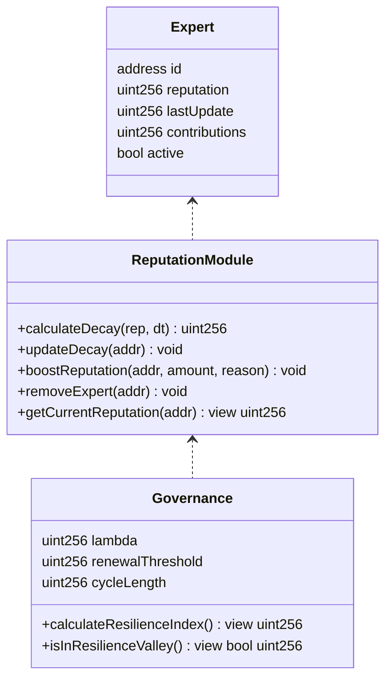
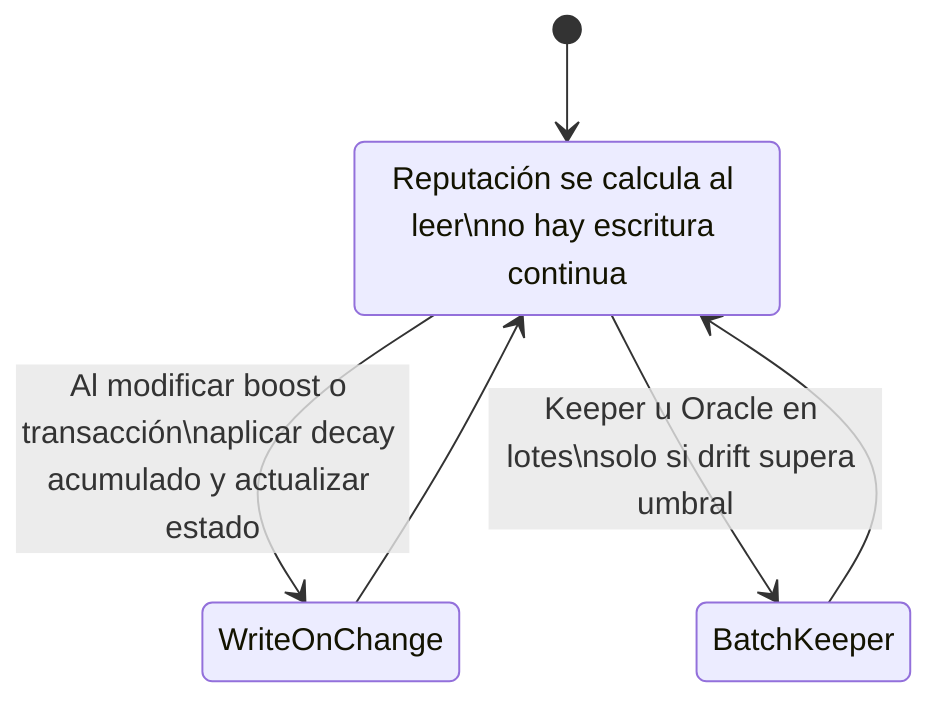
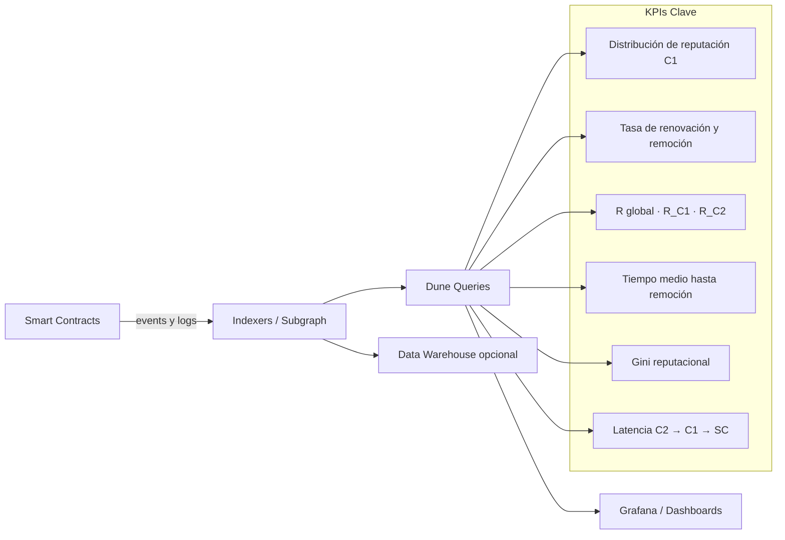

# Gobernanza Bicameral
### Arquitectura de decisión distribuida basada en el Valle de Resiliencia
#### Módulo de la DAO de Memoria Finita (FMD-DAO) · Ernesto Cisneros Cino

---

## Índice

- [¿Por qué bicameral?](#por-qué-bicameral)
- [Las dos cámaras](#las-dos-cámaras)
- [Arquitectura del sistema](#arquitectura-del-sistema)
- [Flujo de una propuesta](#flujo-de-una-propuesta)
- [El ciclo de resiliencia](#el-ciclo-de-resiliencia)
- [Reputación y decay](#reputación-y-decay)
- [Observabilidad y KPIs](#observabilidad-y-kpis)
- [Seguridad](#seguridad)
- [Estructura del repositorio](#estructura-del-repositorio)
- [Licencia](#licencia)

---

## ¿Por qué bicameral?

Un sistema gobernado solo por expertos colapsa por rigidez: pierde contacto con la realidad de quienes lo habitan. Un sistema gobernado solo por la mayoría colapsa por ruido: las decisiones técnicas requieren conocimiento que no se distribuye uniformemente.

La bicameralidad no es una concesión política. Es una **necesidad termodinámica**: dos fuentes de señal complementarias que se corrigen mutuamente.

> Un sistema sin sabiduría colapsa por ruido.
> Un sistema sin pueblo colapsa por rigidez.

La FMD-DAO separa explícitamente dos funciones que en la mayoría de DAOs se confunden: **legitimar** (C2) y **validar** (C1). Ambas son necesarias. Ninguna es suficiente sola.

---

## Las dos cámaras

| | C2 — Cámara de los Comunes | C1 — Cámara de Expertos |
|---|---|---|
| **Función** | Propuestas, señales, legitimidad | Validación técnica, auditoría |
| **Quién** | Cualquier miembro verificado | Expertos con reputación activa |
| **Incentivo** | Reconocimiento, participación | Incentivos proporcionales a contribución |
| **Peso** | Legitimidad democrática | Autoridad técnica con decay |
| **Riesgo** | Captura emocional, populismo | Captura técnica, oligarquía |
| **Mitigación** | Revisión cruzada por C1 | Decay exponencial + rotación |

---

## Arquitectura del sistema

El sistema se organiza en cuatro capas que interactúan sin acoplamiento directo:



Cada capa tiene una responsabilidad única y no invade la de las demás. La comunidad propone y vota; los contratos ejecutan y registran; los oráculos sincronizan el tiempo y los parámetros; la capa de observabilidad hace todo visible y auditable.

---

## Flujo de una propuesta

Una propuesta recorre cinco etapas desde que un miembro la crea hasta que el sistema la ejecuta:



El **pareo ciego** en C1 es un mecanismo de auditoría donde los expertos evalúan propuestas sin conocer la identidad del proponente, reduciendo el sesgo de afinidad.

---

## El ciclo de resiliencia

El sistema no opera en modo continuo — opera en **ciclos** sincronizados por el Índice de Resiliencia R.



El Valle de Resiliencia (1 ≤ R ≤ 3) es el estado de salud del sistema. Caer por debajo indica amnesia institucional — el sistema olvida demasiado rápido. Superar el límite superior indica rigidez — el sistema recuerda demasiado y se fosiliza.

### El Ritual Trimestral

Cada aproximadamente 90 días, el sistema ejecuta un ciclo de mantenimiento obligatorio que ninguna cámara puede bloquear:

- **Decay**: se aplica el decaimiento exponencial acumulado a toda la reputación de C1. Los expertos con reputación por debajo del 5% son retirados automáticamente.
- **Rotación**: los expertos con mandatos vencidos salen por lotería ponderada. Esto evita oligarquías permanentes.
- **Calibración**: los parámetros λ, umbrales y quórums se ajustan según el R actual y el historial del ciclo.

---

## Reputación y decay

La reputación en C1 no es una propiedad estática — es un flujo que se mantiene activamente o se pierde.



### Modelo de escritura virtualizada

El decay no se escribe en cadena continuamente — eso sería prohibitivamente costoso en gas. En su lugar, el sistema usa un modelo de **escritura diferida**:



La reputación real de un experto se calcula en el momento en que se necesita, aplicando el decay acumulado desde la última escritura. Esto reduce el coste de gas sin sacrificar precisión.

---

## Observabilidad y KPIs

Todo lo que ocurre on-chain es indexado y visible. La transparencia no es una promesa — es una consecuencia de la arquitectura.



El **Gini reputacional** es especialmente relevante: mide la concentración de reputación dentro de C1. Un Gini alto indica que pocos expertos concentran demasiada influencia — señal de alerta para el Sistema Inmunológico.

---

## Seguridad

Los vectores de ataque en cada capa y sus mitigaciones:

```mermaid
mindmap
  root((Seguridad FMD-DAO))
    C1 Expertos
      Rotación y lotería ponderada
      Límites de mandato
      Decay exponencial
      Auditoría por pares
    C2 Comunes
      Verificación de unicidad ZK y POH
      Quórums por cohorte temporal
      Anti-brigading
    Parámetros
      Timelock en cambios críticos
      Pausa de emergencia circuit breaker
      Calibración dinámica de λ y umbrales
    Economía
      No pay-to-speak
      Recompensas funcionales no monetarias
    Observabilidad
      Tableros públicos de R
      Logs del Ritual trimestral
```



### Principios de seguridad no negociables

```txt
No execution without trace.
No rule change without delay.
No authority without exposure.
```

Ningún cambio en los contratos se ejecuta sin registro. Ningún parámetro crítico cambia sin timelock. Ningún experto ejerce autoridad sin que su reputación esté expuesta al decay.

---

## Estructura del repositorio

```
FMD-DAO/
├── contracts/
│   ├── FMDDAOCore.sol          # Núcleo de gobernanza bicameral
│   ├── ReputationModule.sol    # Decay exponencial y gestión de expertos
│   └── GovernanceParams.sol    # Parámetros τ, Ω, λ, umbrales
├── subgraph/
│   └── schema.graphql          # Esquema de indexación
├── docs/
│   └── gobernanza-bicameral.md # Este archivo
├── dashboards/
│   ├── dune.sql                # Queries de KPIs
│   └── grafana.json            # Configuración de dashboards
├── test/
│   └── *.test.ts               # Tests de integración
└── README.md                   # Resumen y enlaces a /docs
```

---

## Relación con otros módulos

```txt
FMD-DAO
├── Gobernanza Bicameral  ◄── este módulo
│     ├── Define las dos cámaras y sus roles
│     ├── Gestiona el flujo de propuestas
│     └── Ejecuta el Ritual Trimestral
│
├── Memoria Finita
│     └── El decay de C1 es la implementación directa
│         del principio de memoria finita en la cámara experta
│
├── Ruido Estabilizador
│     └── Los parámetros τ y Ω reciben variación controlada
│         para evitar sincronizaciones predecibles
│
├── Sistema Inmunológico
│     └── Monitorea el Gini reputacional de C1
│         y ajusta pesos de cámara durante crisis
│
└── HumanLayer
      └── Añade los mecanismos de oscilación ideológica
          y Proof of Understanding sobre este flujo base
```

---

## Licencia

MIT License · Ernesto Cisneros Cino

---

*Parte del proyecto [DAO de Memoria Finita (FMD-DAO)](https://github.com/cisnerosmusic/DAO_de_Memoria_Finita_-FMD-DAO-)*

*"La bicameralidad no es una concesión política. Es una necesidad termodinámica."*
